# 北醒雷达通用检查上位机

## 1 实现功能
实现北醒不同接口（UART、IIC、RS485、RS232）雷达的基本配置检查。
上位机实现功能如下：
> - 界面语言切换
> - 一键检查
> - 单项检查
> - 自动保存检查结果到 txt 文件中
> - 自定义 JSON 文件

上位机不同接口的主要检查功能如下：

|    接口     | UART | IIC | RS485 | RS232 |
| :---------: | :--: | :-: | :---: | :---: |
|   序列号    |  ✔   |  ✔  |  ❌   |   ✔   |
|  固件版本   |  ✔   |  ✔  |   ✔   |   ✔   |
|  输出帧率   |  ✔   | ❌  |   ✔   |   ✔   |
|  测距结果   |  ✔   |  ✔  |   ✔   |   ✔   |
| I2C从机地址 |  ❌  |  ✔  |  ❌   |  ❌   |
|   SlaveID   |  ❌  | ❌  |   ✔   |  ❌   |
|  测试强度   |  ❌  | ❌  |   ✔   |  ❌   |
|  测试结果   |  ❌  | ❌  |   ✔   |  ❌   |


## 2 使用步骤
### 2.1 选择界面语言
- 上位机的界面语言默认为中文，若需要切换为英文界面，点击语言菜单栏下对应的语言即可进行切换

>   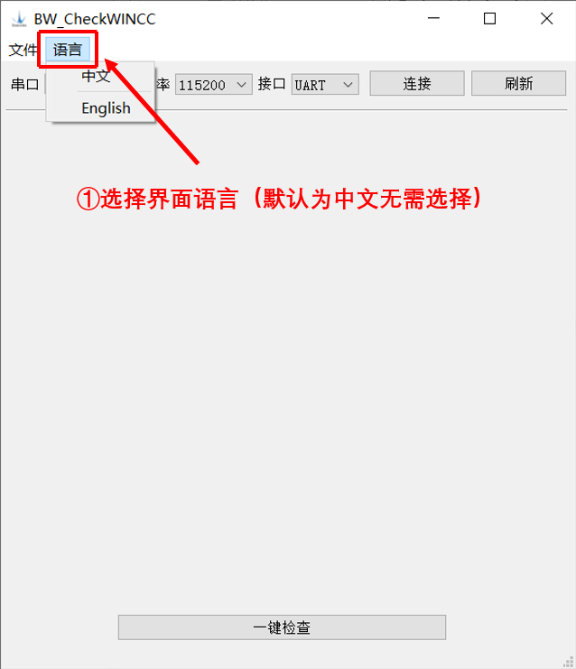


### 2.2 选择 JSON 文件
- 点击文件菜单栏下的打开（快捷键：Ctr + O），选择对应接口的 JSON 文件后，上位机会读取 JSON 文件里的数据并自动生成相应的界面。
- 通过连接不同的接口版本，选择不同的 JSON 文件，能够检查不同接口下的雷达配置。

> 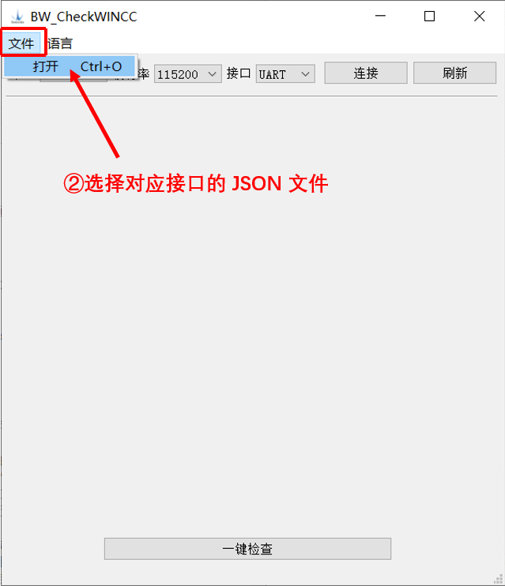

### 2.3 连接和刷新串口
- 选择雷达对应的串口、波特率、接口版本后，点击连接按钮，若按钮显示已连接，则成功连接串口。
- 除此之外， 再次点击连接按钮即可断开连接，刷新按钮可对串口列表进行刷新。


> 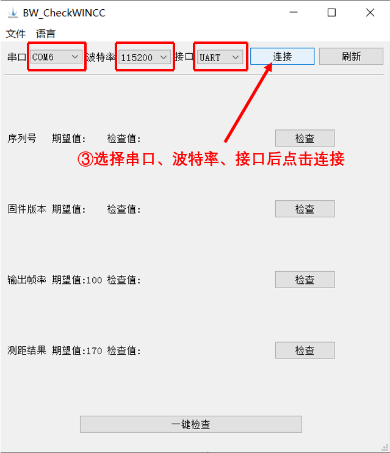


### 2.4 检查配置
- 按钮显示已连接后，点击一键检查按钮即可对 JSON 文件中雷达的所有配置进行检查；也可对雷达的某一项配置单独进行检查。

- 每点击一次一键检查，上位机会自动生成一个 txt 文档并把一键检查的结果自动写入到 txt 文档中
- 点击单项检查，不写入到 txt 文档中

>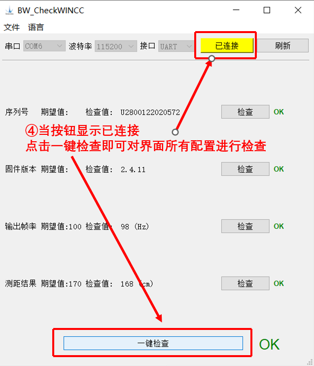 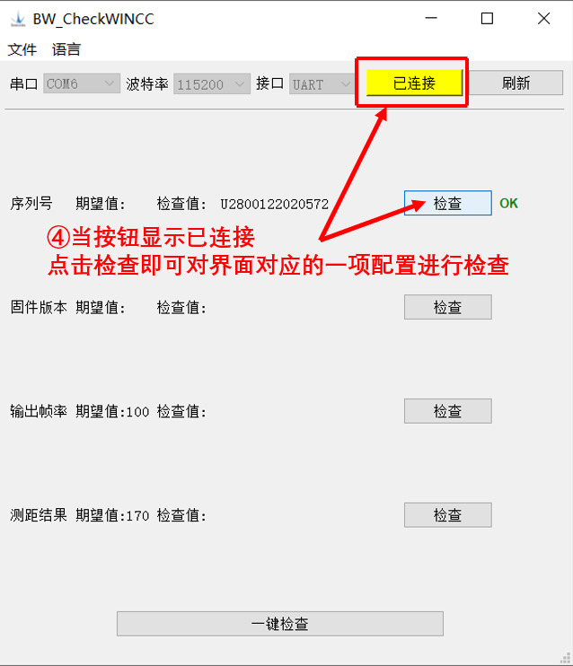


## 3 界面演示
### 3.1 中文演示
> 

### 3.2 英文演示
> 

## 4 检查结果
### 4.1 自动保存方式

- 上位机在第一次点击一键检查按钮时，会新建一个以当天日期命名的文件夹到运行软件的当前目录下。示例：
> 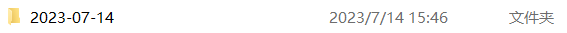
- 每点击一次一键检查按钮，会自动将检查结果保存为一个 txt 文件。
- UART、IIC、RS232 接口下 txt 文件的命名方式为：`序列号 + 检查结果 + 一键检查次数`，示例：
> 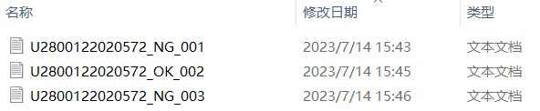
- RS485 接口下暂无检查序列号的指令，txt 文件的命名方式为：`RS485 + ID值 + 检查结果 + 一键检查次数`，示例：
> 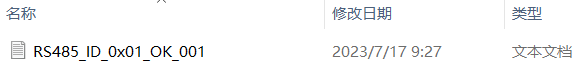
- 点击某一项配置的检查按钮时，能够对该配置项进行单独检查，但检查结果仅供查看，不写入到 txt 文件中保存


### 4.2 txt 文件说明
- 一键检查的结果保存在 txt 文件中的格式为：
> `检查项名称： 期望值：  检查值： 结果：`
> `发送cmd：`
> `接收cmd：`

|     名称     | <div style="text-align: center">写入到 txt 文件的逻辑说明</div> |
| :-----------: | :------------------------------------------------------------------------------- |
| 检查项名称 | 通过读取 JSON 文件的 "name" 项里的值写入，如"序列号"，"固件版本"  |
|   期望值    | 通过读取 JSON 文件的 "std" 项里的值写入                                 |
|   检查值    | 通过读取标签上显示的检查结果的值写入                                     |
|     结果     | 通过读取回显结果 OK/NG 的标签值写入                                      |
|   发送cmd   | 通过读取 JSON 文件的 "cmd" 项里的值写入                                 |
|   接收cmd   | 通过从串口读取接收指令的值写入                                             |


- 一键检查结果 OK 的示例：
>
- 一键检查结果 NG 的示例：
> 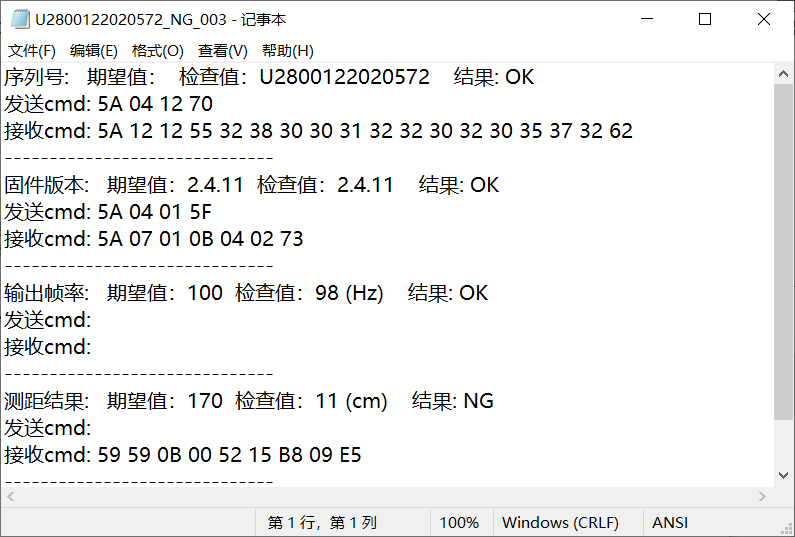


## 附：上位机逻辑实现说明
### 1 自定义 JSON 文件说明
若需要对更多的雷达配置进行检查，可以对 JSON 文件进行修改。

#### 1.1 JSON 文件介绍：
 
 
|  名称  | <div style="text-align: center">解释</div>                                                                                                                                                                                                |
| :----: | :--------------------------------------------------------------------------------------------------------------------------------------------------------------------------------------------------------------------------------------- |
|   id   | 作为某项配置的标识，生成界面按照 id 值的顺序进行生成                                                                                                                                                                                         |
|  name  | 检查雷达某项配置的名称，如"序列号"，"固件版本"                                                                                                                                                                                              |
| widget | 显示检查结果的组件类型（一般为"QLabel"，即检查值在标签上显示）                                                                                                                                                                               |
| button | 点击按钮的显示名称，如中文界面显示为检查，英文界面显示为 Check，可自定义修改                                                                                                                                                                  |
|  std   | 期望值，即期望雷达检查出来的值，可自定义设置<br>- 若为空 ''，则检查值不与期望值作比较，雷达接收的检查值显示在标签上，只要接收回显指令的帧头无误则返回结果为 OK<br>- 若设置期望值，只有当检查值和期望值的标签完全相同时，返回结果显示为 OK，否则显示为 NG |
|  cmd   | 检查雷达某项配置时需要发送的指令<br>- 若为空 ''，则不发送指令<br>- 若不为空，则发送指令并接收回显进行判断                                                                                                                                       |


#### 1.2 不同接口下的说明
#####  UART：
###### JSON 文件
```json
[
    {"id": 0, "name": "序列号", "widget": "QLabel", "button": "检查", "std": "", "cmd": "5A 04 12 70"},
    {"id": 1, "name": "固件版本", "widget": "QLabel", "button": "检查", "std": "2.4.11", "cmd": "5A 04 01 5F"},
    {"id": 2, "name": "输出帧率", "widget": "QLabel", "button": "检查", "std": "100", "cmd": ""},
    {"id": 3, "name": "测距结果", "widget": "QLabel", "button": "检查", "std": "170", "cmd": ""}
]
```
###### 生成界面
> 

###### 修改说明

- 增加新的自定义检查项

    - 增加的检查项有cmd：若 cmd 不为空，则发送指令cmd后接收回显指令并显示在对应的标签上，示例：
    > 
    - 增加的检查项无cmd：若 cmd 为空，则接收雷达9字节数据帧，并解析为距离值 D，强度值 S，温度值 T，示例：
    > 
    - JSON文件和生成界面如下：
        ```json
        [
            {"id": 0, "name": "序列号", "widget": "QLabel", "button": "检查", "std": "", "cmd": "5A 04 12 70"},
            {"id": 1, "name": "固件版本", "widget": "QLabel", "button": "检查", "std": "2.4.11", "cmd": "5A 04 01 5F"},
            {"id": 2, "name": "输出帧率", "widget": "QLabel", "button": "检查", "std": "100", "cmd": ""},
            {"id": 3, "name": "测距结果", "widget": "QLabel", "button": "检查", "std": "170", "cmd": ""},
            {"id": 4, "name": "测试有cmd", "widget": "QLabel", "button": "检查", "std": "5A 05 11 00 70", "cmd": "5A 04 11 6F"},
            {"id": 5, "name": "测试无cmd", "widget": "QLabel", "button": "检查", "std": "", "cmd": ""}
        ]
        ```
   
        


- 减少原有的检查项
    - 若无需检查测距结果，则删除 JSON 文件中测距结果所在行即可。
    JSON文件和生成界面如下：
        ```json
        [
            {"id": 0, "name": "序列号", "widget": "QLabel", "button": "检查", "std": "", "cmd": "5A 04 12 70"},
            {"id": 1, "name": "固件版本", "widget": "QLabel", "button": "检查", "std": "2.4.11", "cmd": "5A 04 01 5F"},
            {"id": 2, "name": "输出帧率", "widget": "QLabel", "button": "检查", "std": "100", "cmd": ""}
        ]
        ```    
        


##### IIC：

###### JSON 文件

```json
[
    {"id": 0, "name": "序列号", "widget": "QLabel", "button": "检查", "std": "", "cmd": "5A 04 12 70"},
    {"id": 1, "name": "I2C从机地址", "widget": "QLabel", "button": "检查", "std": "0x10", "cmd": ""},
    {"id": 2, "name": "固件版本", "widget": "QLabel", "button": "检查", "std": "2.4.11", "cmd": "5A 04 01 5F"},
    {"id": 3, "name": "测距结果", "widget": "QLabel", "button": "检查", "std": "170", "cmd": ""}
]
```

###### 生成界面
> 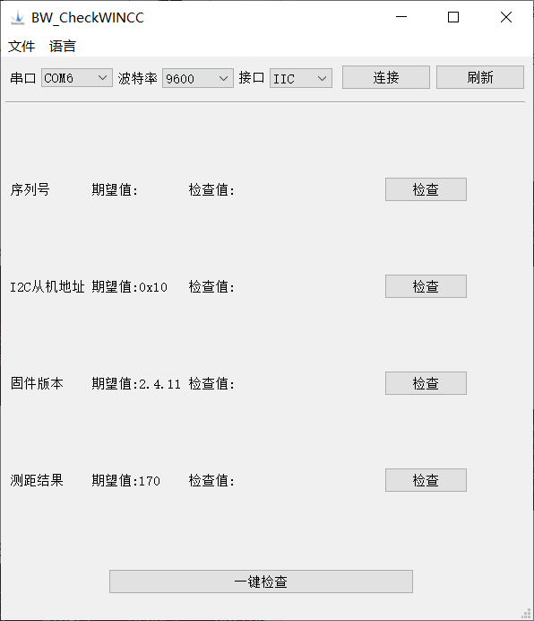

###### 修改说明
- 增加新的自定义检查项

    - 增加的检查项有cmd：若 cmd 不为空，则发送指令cmd后接收回显指令并显示在对应的标签上，示例：
    > 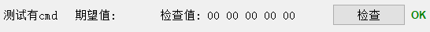
    - 增加的检查项无cmd：若 cmd 为空，则发送测距指令接收雷达9字节数据帧，并解析为距离值 D，强度值 S，温度值 T，示例：
    > 
    - JSON文件和生成界面如下：
        ```json
        [
            {"id": 0, "name": "序列号", "widget": "QLabel", "button": "检查", "std": "", "cmd": "5A 04 12 70"},
            {"id": 1, "name": "I2C从机地址", "widget": "QLabel", "button": "检查", "std": "0x10", "cmd": ""},
            {"id": 2, "name": "固件版本", "widget": "QLabel", "button": "检查", "std": "", "cmd": "5A 04 01 5F"},
            {"id": 3, "name": "测距结果", "widget": "QLabel", "button": "检查", "std": "170", "cmd": ""},
            {"id": 4, "name": "测试有cmd", "widget": "QLabel", "button": "检查", "std": "5A 05 11 00 70", "cmd": "5A 04 11 6F"},
            {"id": 5, "name": "测试无cmd", "widget": "QLabel", "button": "检查", "std": "", "cmd": ""}
        ]
        ```    

        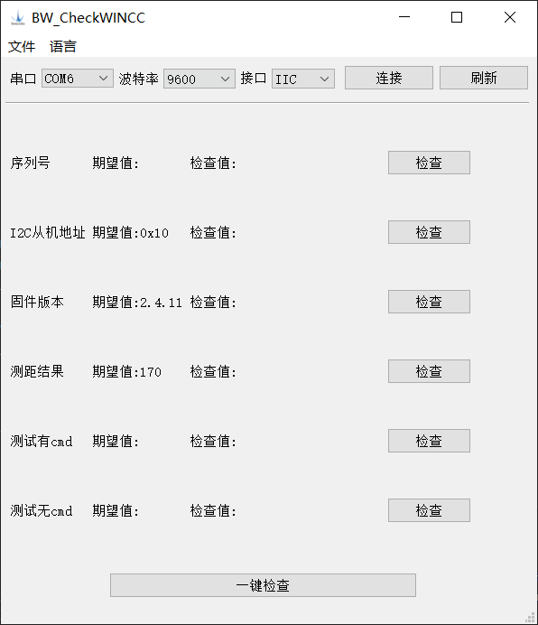


- 减少原有的检查项
    - 若无需检查测距结果，则删除 JSON 文件中测距结果所在行即可。
    JSON文件和生成界面如下：
        ```json
        [
            {"id": 0, "name": "序列号", "widget": "QLabel", "button": "检查", "std": "", "cmd": "5A 04 12 70"},
            {"id": 1, "name": "I2C从机地址", "widget": "QLabel", "button": "检查", "std": "0x10", "cmd": ""},
            {"id": 2, "name": "固件版本", "widget": "QLabel", "button": "检查", "std": "", "cmd": "5A 04 01 5F"}
        ]
        ```       
        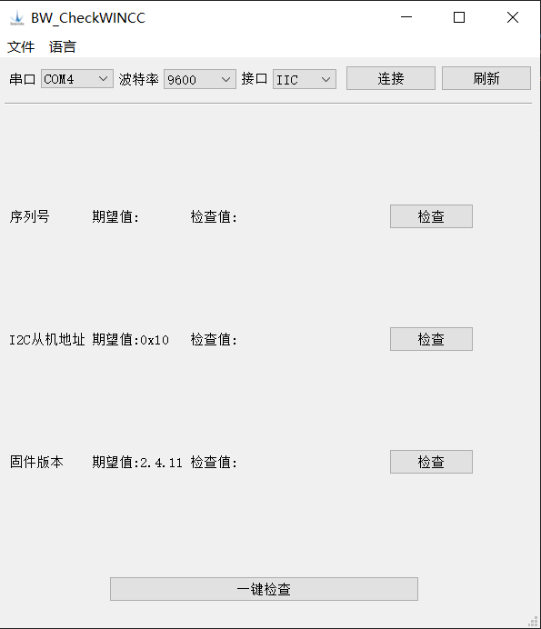

##### RS485：
- 由于RS485接口在Modbus协议模式下，从机只能被动地接收和发送数据，输出帧率为0，默认一键检查时跳过输出帧率的检查；
- 当切换为RS485串口模式，雷达主动发送9字节的数据帧，此时可以检查输出帧率，点击检查按钮即可。

###### JSON 文件

```json
[
    {"id": 0, "name": "SlaveID", "widget": "QLabel", "button": "检查", "std": "0x01", "cmd": ""},
    {"id": 1, "name": "固件版本", "widget": "QLabel", "button": "检查", "std": "3.2.28", "cmd": "ADDR 03 00 06 00 02"},
    {"id": 2, "name": "测距结果", "widget": "QLabel", "button": "检查", "std": "170", "cmd": "ADDR 03 00 00 00 01"},
    {"id": 3, "name": "测试强度", "widget": "QLabel", "button": "检查", "std": "", "cmd": "ADDR 03 00 01 00 01"},
    {"id": 4, "name": "测试结果", "widget": "QLabel", "button": "检查", "std": "", "cmd": "ADDR 03 00 00 00 02"},
    {"id": 5, "name": "输出帧率", "widget": "QLabel", "button": "检查", "std": "", "cmd": ""}
]
```


###### 生成界面
> 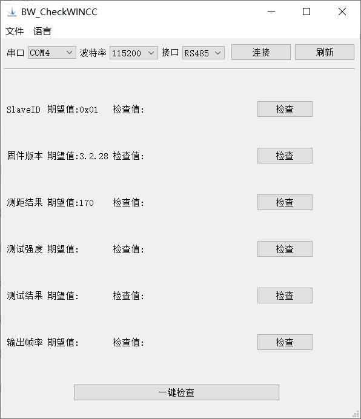

###### 修改说明
- 增加新的自定义检查项
    - 增加的检查项有cmd：若 cmd 不为空，则发送指令cmd后接收回显指令并显示在对应的标签上，示例：
    > 

    - 增加的检查项无cmd：若 cmd 为空，则接收雷达测距返回的数据帧，并解析找到 ID 值和距离值 D，示例：
    > 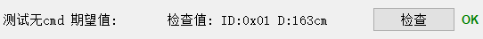
    - JSON文件和生成界面如下：
        ```json
        [
        {"id": 0, "name": "SlaveID", "widget": "QLabel", "button": "检查", "std": "0x01", "cmd": ""},
        {"id": 1, "name": "固件版本", "widget": "QLabel", "button": "检查", "std": "3.2.28", "cmd": "ADDR 03 00 06 00 02"},
        {"id": 2, "name": "测距结果", "widget": "QLabel", "button": "检查", "std": "170", "cmd": "ADDR 03 00 00 00 01"},
        {"id": 3, "name": "测试强度", "widget": "QLabel", "button": "检查", "std": "", "cmd": "ADDR 03 00 01 00 01"},
        {"id": 4, "name": "测试结果", "widget": "QLabel", "button": "检查", "std": "", "cmd": "ADDR 03 00 00 00 02"},
        {"id": 5, "name": "输出帧率", "widget": "QLabel", "button": "检查", "std": "", "cmd": ""},
        {"id": 6, "name": "测试有cmd", "widget": "QLabel", "button": "检查", "std": "", "cmd": "ADDR 03 00 00 00 01"},
        {"id": 7, "name": "测试无cmd", "widget": "QLabel", "button": "检查", "std": "", "cmd": ""}
        ]
        ```
        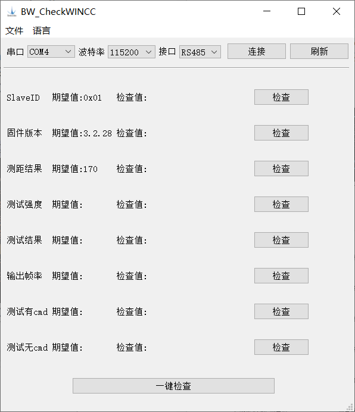


- 减少原有的检查项
    - 若无需检查输出帧率，则删除 JSON 文件中输出帧率所在行即可。
    JSON文件和生成界面如下：
        ```json
        [
        {"id": 0, "name": "SlaveID", "widget": "QLabel", "button": "检查", "std": "0x01", "cmd": ""},
        {"id": 1, "name": "固件版本", "widget": "QLabel", "button": "检查", "std": "3.2.28", "cmd": "ADDR 03 00 06 00 02"},
        {"id": 2, "name": "测距结果", "widget": "QLabel", "button": "检查", "std": "170", "cmd": "ADDR 03 00 00 00 01"},
        {"id": 3, "name": "测试强度", "widget": "QLabel", "button": "检查", "std": "", "cmd": "ADDR 03 00 01 00 01"},
        {"id": 4, "name": "测试结果", "widget": "QLabel", "button": "检查", "std": "", "cmd": "ADDR 03 00 00 00 02"}
        ]
        ```    

        

##### RS232：
###### JSON 文件
```json
[
    {"id": 0, "name": "序列号", "widget": "QLabel", "button": "检查", "std": "", "cmd": "5A 05 56 00 B5"},
    {"id": 1, "name": "固件版本", "widget": "QLabel", "button": "检查", "std": "2.4.11", "cmd": "5A 04 01 5F"},
    {"id": 2, "name": "输出帧率", "widget": "QLabel", "button": "检查", "std": "100", "cmd": ""},
    {"id": 3, "name": "测距结果", "widget": "QLabel", "button": "检查", "std": "170", "cmd": ""}
]
```

###### 生成界面
> 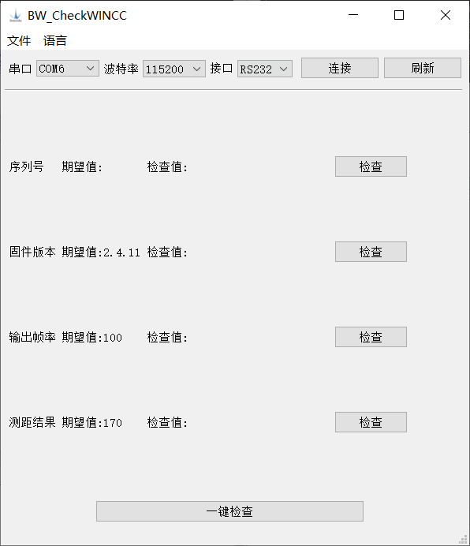

###### 修改说明
- 增加新的自定义检查项

    - 增加的检查项有cmd：若 cmd 不为空，则发送指令cmd后接收回显指令并显示在对应的标签上，示例：
    > 
    - 增加的检查项无cmd：若 cmd 为空，则接收雷达9字节数据帧，并解析为距离值 D，强度值 S，温度值 T，示例：
    > 
    - JSON文件和生成界面如下：
        ```json
        [
            {"id": 0, "name": "序列号", "widget": "QLabel", "button": "检查", "std": "", "cmd": "5A 05 56 00 B5"},
            {"id": 1, "name": "固件版本", "widget": "QLabel", "button": "检查", "std": "2.4.11", "cmd": "5A 04 01 5F"},
            {"id": 2, "name": "输出帧率", "widget": "QLabel", "button": "检查", "std": "100", "cmd": ""},
            {"id": 3, "name": "测距结果", "widget": "QLabel", "button": "检查", "std": "170", "cmd": ""},
            {"id": 4, "name": "测试有cmd", "widget": "QLabel", "button": "检查", "std": "5A 05 11 00 70", "cmd": "5A 04 11 6F"},
            {"id": 5, "name": "测试无cmd", "widget": "QLabel", "button": "检查", "std": "", "cmd": ""}
        ]
        ```    

        


- 减少原有的检查项
    - 若无需检查测距结果，则删除 JSON 文件中测距结果所在行即可。
    JSON文件和生成界面如下：
        ```json
        [
            {"id": 0, "name": "序列号", "widget": "QLabel", "button": "检查", "std": "", "cmd": "5A 05 56 00 B5"},
            {"id": 1, "name": "固件版本", "widget": "QLabel", "button": "检查", "std": "2.4.11", "cmd": "5A 04 01 5F"},
            {"id": 2, "name": "输出帧率", "widget": "QLabel", "button": "检查", "std": "100", "cmd": ""}
        ]
        ```
        


### 2 检查序列号逻辑说明

| <div style="text-align: center">UART、IIC（除 TF03 系列外）</div>                                                                                                                                                               | <div style="text-align: center">RS232（TF03 系列）</div>                                                                                                                                                                           |
| :------------------------------------------------------------------------------------------------------------------------------------------------------------------------------------------------------------------------------ | :--------------------------------------------------------------------------------------------------------------------------------------------------------------------------------------------------------------------------------- |
| 1. 发送序列号指令"5A 04 12 70"<br>2. 接收18个字节的回显指令<br>3. 判断帧头是否为5A<br>4. 判断指令的ID码是否为0x12<br>5. 从接收指令中截取序列号数据段并解析<br>6. 显示在对应的序列号标签上<br>7. 写入检查结果、发送和接收指令到 txt 文件 | 1. 发送序列号指令"5A 05 56 00 B5"<br>2. 接收19个字节的回显指令<br>3. 判断帧头是否为5A<br>4. 判断指令的ID码是否为0x56<br>5. 从接收指令中截取序列号数据段并解析<br>6. 显示在对应的序列号标签上<br>7. 写入检查结果、发送和接收指令到 txt 文件 |

::: alert-warning
**注意：**
- TF03 系列激光雷达在 UART 和 RS232 接口下检查序列号的指令为 "5A 05 56 00 B5"
- 其余 TF 系列激光雷达在 UART 接口下检查序列号的指令为 "5A 04 12 70"

:::

### 3 检查固件版本逻辑说明

| <div style="text-align: center">UART、IIC、RS232</div>                                                                                                                                                                                                                                | <div style="text-align: center">RS485</div>                                                                                                                                                                                                                                                                |
| :--------------------------------------------------------------------------------------------------------------------------------------------------------------------------------------------------------------------------------------------------------------------------------------------------- | :--------------------------------------------------------------------------------------------------------------------------------------------------------------------------------------------------------------------------------------------------------------------------------------------------------------------- |
| 1. 发送固件版本指令"5A 04 01 5F"<br>2. 接收7个字节的回显指令<br>3. 判断帧头是否为5A<br>4. 判断指令的ID码是否为0x01<br>5. 从接收指令中截取固件版本数据段并解析<br>6. 显示在对应的固件版本标签上<br>7. 写入检查结果、发送和接收指令到 txt 文件 | 1. 发送固件版本指令"ADDR 03 00 06 00 02"<br>2. 接收9个字节的回显指令<br>3. 判断帧头是否为"ADDR"<br>4. 判断指令的功能码是否为0x03<br>5. 从接收指令中截取固件版本数据段并解析<br>6. 显示在对应的固件版本标签上<br>7. 写入检查结果、发送和接收指令到 txt 文件 |

### 4 检查输出帧率逻辑说明

| <div style="text-align: center">UART、RS485、RS232</div>                                                                                                                                                                                                                                                                                        |
| :-------------------------------------------------------------------------------------------------------------------------------------------------------------------------------------------------------------------------------------------------------------------------------------------------------------------------------------------------------------- |
| 1.不停从串口接收数据（读取 9 个字节作为一个数据帧）<br>2. 计算输出帧率（1秒内接收的总数据帧数除以时间并四舍五入取整）<br>3. 若有期望值，则判断期望值和检查值是否在允许的误差范围内（默认为 20 Hz）<br>4. 显示在对应的输出帧率标签上<br>5.  写入检查结果到 txt 文件，其中发送指令和接收指令为空 |

### 5 检查测距结果逻辑说明

| <div style="text-align: center">UART、RS232</div>                                                                                                                                                                                                                                                                                                                                        | <div style="text-align: center">IIC</div>                                                                                                                                                                                                                                                                                                                                   | <div style="text-align: center">RS485</div>                                                                                                                                                                                                                                                                                                                                                    |
| :----------------------------------------------------------------------------------------------------------------------------------------------------------------------------------------------------------------------------------------------------------------------------------------------------------------------------------------------------------------------------------------------------- | :------------------------------------------------------------------------------------------------------------------------------------------------------------------------------------------------------------------------------------------------------------------------------------------------------------------------------------------------------------------------------------- | :---------------------------------------------------------------------------------------------------------------------------------------------------------------------------------------------------------------------------------------------------------------------------------------------------------------------------------------------------------------------------------------------------------- |
| 1. 若串口有数据接收，则接收9个字节；<br>（否则发送单次触发指令"5A 04 04 62"）<br>2. 判断帧头是否为59 59<br>3. 从接收指令中截取距离数据段并解析<br>4. 若有期望值，则判断期望值和检查值是否在允许的误差范围内（默认为 20 cm）<br>5. 显示在对应的测距结果标签上<br>6. 写入检查结果、接收指令到 txt 文件<br>（其中发送指令为空） | 1. 发送测距指令"53 W 05 5A 05 00 01 60 50 53 R 09 50"<br>2. 接收9个字节的回显指令<br>3. 判断帧头是否为59 59<br>4. 从接收指令中截取距离数据段并解析<br>5. 若有期望值，则判断期望值和检查值是否在允许的误差范围内（默认为 20 cm）<br>6. 显示在对应的测距结果标签上<br>7. 写入检查结果、发送和接收指令到 txt 文件 | 1. 发送测距指令"ADDR 03 00 00 00 01"<br>2. 接收7个字节的回显指令<br>3. 判断帧头是否为"ADDR"<br>4. 判断指令的功能码是否为0x03<br>5. 从接收指令中截取距离数据段并解析<br>6. 若有期望值，则判断期望值和检查值是否在允许的误差范围内（默认为 20 cm）<br>7. 显示在对应的测距结果标签上<br>8. 写入检查结果、发送和接收指令到 txt 文件 |

### 6 检查SlaveID逻辑说明

| <div style="text-align: center">RS485</div>                                                                                                                                                                                                        |
| :-------------------------------------------------------------------------------------------------------------------------------------------------------------------------------------------------------------------------------------------------------------- |
| 1.通过发送测距指令"ADDR 03 00 00 00 01"轮询SlaveID（1-247）<br>2.  直到串口有数据接收，则接收7个字节<br>3. 判断指令的功能码是否为0x03，若是则记录当前SlaveID值<br>4.  写入检查结果、发送和接收指令到 txt 文件 |

### 7 检查IIC地址逻辑说明

| <div style="text-align: center">IIC</div>                                                                                                                                                                                                                                     |
| :---------------------------------------------------------------------------------------------------------------------------------------------------------------------------------------------------------------------------------------------------------------------------------------- |
| 1.通过发送测距指令"53 W 05 5A 05 00 01 60 50 53 R 09 50"轮询IIC从机地址（1-127）<br>2.  直到串口有数据接收，则接收9个字节<br>3. 判断指令的帧头是否为59 59，若是则记录当前从机地址值<br>4.  写入检查结果、发送和接收指令到 txt 文件 |

## 补充说明
### JSON 文件修改补充
- 上位机提供对原有 JSON 文件的某些检查项进行增减的功能，JSON 文件中的 "name" 为检查雷达某项配置的名称。

::: alert-danger
**警告：**

- 请勿轻易修改默认 JSON 文件中的 "name" 中的配置名称
- 否则导致某些配置在检查时无法进行数据解析，只能返回接收指令值，可读性下降。
:::
 -  其中不可修改的JSON文件里的 "name" 如下：


<center>

|     中文      |      英文       |
| :-----------: | :-------------: |
|   "序列号"    | "SerialNumber"  |
|  "固件版本"   |  "FirmwareVer"  |
|  "输出帧率"   |   "FrameRate"   |
|  "测距结果"   | "RangingResult" |
| "I2C从机地址" |  "I2C Address"  |
|  "测试强度"   | "TestStrength"  |
|  "测试结果"   |  "TestResult"   |
|   "SlaveID"   |    "SlaveID"    |

</center> 

::: alert-warning
**注意：**
- std 和 cmd 为空时为 ''（中间不加空格或其他特殊符号）。
- 在对 JSON 文件进行修改时，需留意 JSON 的代码格式：在每对大括号 {} 之间需用逗号进行连接，且最后一对大括号 {} 后无需逗号 。

:::


### TF-Luna 雷达检查和配置补充
- 上位机是基于发送串口指令接收回显的原理进行配置的检查，但 TF-Luna 激光雷达在 IIC 模式下是通过读取寄存器值来进行验证。

::: alert-warning
**注意：**
目前 TF-Luna 通过串口收发指令进行配置检查仅支持的 JSON 文件里 "name" 的值如下：
:::
<center>

|     中文      |      英文       |
| :-----------: | :-------------: |
|   "序列号"    | "SerialNumber"  |
| "I2C从机地址" |  "I2C Address"  |
|  "固件版本"   |  "FirmwareVer"  |
|  "测距结果"   | "RangingResult" |

</center>   


- TF-Luna 激光雷达在超低功耗模式下的检查和配置

::: alert-info
**提示：**
在进入超低功耗模式后需连续发送5次指令，才能成功唤醒雷达接收回显指令。应修改 JSON 文件里的 "cmd" 示例如下：

:::

<center>

|        修改前         |                                修改后                                 |
| :------------------: | :------------------------------------------------------------------: |
| "cmd": "5A 04 12 70" | "cmd": "5A 04 12 70 5A 04 12 70 5A 04 12 70 5A 04 12 70 5A 04 12 70" |
| "cmd": "5A 04 01 5F" | "cmd": "5A 04 01 5F 5A 04 01 5F 5A 04 01 5F 5A 04 01 5F 5A 04 01 5F" |

</center>

### 从串口读取寄存器补充
- TF 系列支持通过读取寄存器值来进行验证配置项，可以发送指令 "5A 05 3F ID SU" 来进行检查；但 TF03 系列不支持该方式（目前上位机仅验证 TF-Luna 雷达）

::: alert-info
**提示：**
- 其中：
ID 为串口通信软件协议的标识每个功能的ID码
SU 为第 1-4 个字节数据的和的低 8 位
- 示例：检查雷达的输出帧率（ID码为0x03）
发送指令 cmd 为 "5A 05 3F 03 A1"
接收的回显指令为 "5A 06 03 64 00 C7"（表示当前输出帧率为 100Hz）
- 经验证，超低功耗寄存器0x58、增强电流寄存器0x3D无法读取
:::


### 测距结果检查补充
- TF-03 激光雷达在关闭输出的情况下也能单次测距触发；而其他型号激光雷达在关闭输出的情况下检测到输出帧率为 0Hz，无测距数据回显，只有在设置输出帧率为 0Hz后，才能够通过单次触发指令进行测距。


